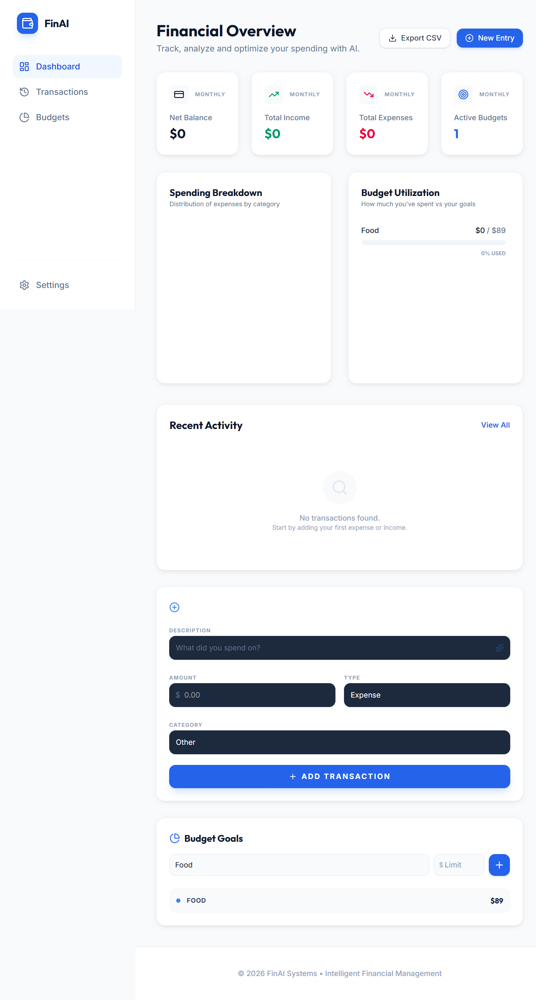

# 💰 FinAI: Intelligent Personal Finance Tracker

FinAI is a modern, AI-powered financial management application designed to simplify expense tracking and budgeting. By leveraging the **Google Gemini 3 Flash** model, FinAI automatically categorizes your transactions, providing instant insights into your spending habits without the manual effort.



## ✨ Key Features

- **🤖 AI-Powered Categorization**: Simply type a description (e.g., "Uber to airport") and let Gemini AI automatically assign the correct category (Transport).
- **📊 Interactive Dashboard**: Visualize your financial health with real-time charts showing spending trends and category distributions.
- **🎯 Budget Management**: Set monthly goals for different categories and track your progress with visual indicators.
- **💾 Persistent Storage**: Your data is automatically saved to your browser's local storage, ensuring your records are always available.
- **📥 CSV Export**: Export your entire transaction history to a CSV file for further analysis in Excel or Google Sheets.
- **📱 Responsive Design**: A beautiful, "Bento-style" UI that works perfectly on desktop, tablet, and mobile.

## 🛠️ Tech Stack

- **Frontend**: [React](https://reactjs.org/) + [TypeScript](https://www.typescriptlang.org/)
- **Styling**: [Tailwind CSS](https://tailwindcss.com/)
- **State Management**: [Redux Toolkit](https://redux-toolkit.js.org/)
- **AI Engine**: [Google Gemini 3 Flash API](https://ai.google.dev/)
- **Charts**: [Recharts](https://recharts.org/)
- **Animations**: [Framer Motion](https://www.framer.com/motion/)
- **Icons**: [Lucide React](https://lucide.dev/)

## 🚀 Getting Started

### Prerequisites

- Node.js (v18 or higher)
- A Google Gemini API Key

### Installation

1. **Clone the repository** 

2. **Install dependencies**
   ```bash
   npm install
   ```

3. **Set up Environment Variables**
   Create a `.env` file in the root directory and add your Gemini API key:
   ```env
   GEMINI_API_KEY=your_api_key_here
   ```

4. **Start the development server**
   ```bash
   npm run dev
   ```

## 📂 Project Structure

- `src/components`: Reusable UI components (Dashboard, Form, List, etc.)
- `src/store`: Redux state management logic and persistence.
- `src/services`: Integration with external APIs (Gemini AI).
- `src/types.ts`: Global TypeScript definitions.

## 📜 License

Distributed under the MIT License. See `LICENSE` for more information.

---

Built with ❤️ for better financial health.
